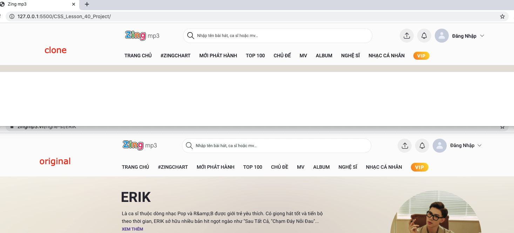

# Bài tập cuối khóa học 
### [PRO] MASTER CSS 2018 - BÀI 40 - TỔNG KẾT VÀ CHỐT HẠ

### CSS PROJECT
Chọn một trang web mà bạn thích, sử dụng kiến thức HTML, CSS đã học, viết lại giao diện trang. 
Yêu cầu: 
1. Sử dụng git trong quá trình code, cố gắng chia nhỏ mỗi commit là một component. 
2. Viết 1 file riêng `components.html` là nơi lưu lại các component trong trang, tách riêng mỗi component ra một file css. 
3. Gửi link github sau khi hoàn thành. 
Ví dụ các trang mẫu: meetup.com, instagram.com, facebook.com, airbnb.com hoặc các giao diện khác trên themeforest.net. Chú ý: Các bạn nên deploy web mình làm lên firebase hosting, sau đó tạo một file README.md (google nếu không biết nó là gì) trong repo của mình, có chứa link tới trang web bạn đã deploy để team tiện review.

### Update lần 1 cho header và screenshot

